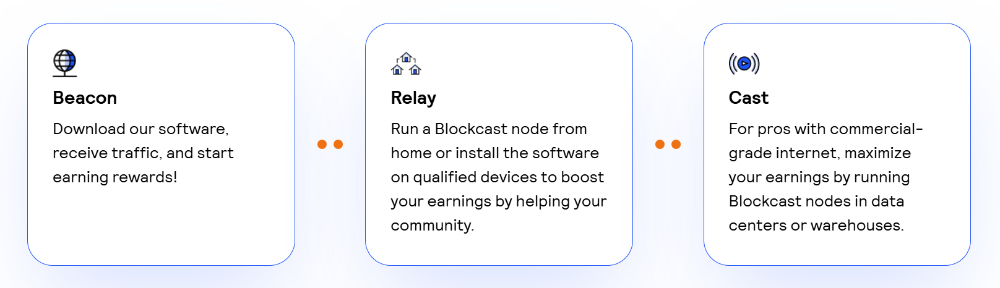

# BlockCast

Blockcast brings together capacity from independent node operators and commercial networks through open standards to enable content delivery services at a fraction of the cost, without compromising security or performance.

<figure><figcaption>
How BlockCast Works
</figcaption></figure>

**Minimum Requirements**:

* **CPU**:
  * Core: 2+
* **RAM**: 4GB+
* **Storage**: 120GB+ SSD/NVME
* **Software**:
  * Docker + Docker-Compose
  * Linux Ubuntu Version : 22.04 LTS
* Recomended VPS: [Contabo ](https://lihat.info/contabo)/ [Vultr](https://lihat.info/vultr)
