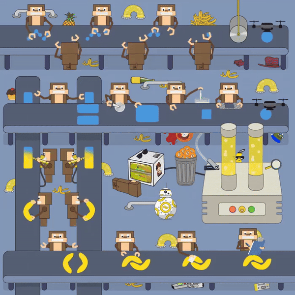

# Banano

**Recommended Hardware**

* Run the node in a datacenter. Most SSD VPS packages will work. but better use NVME vps.
* 1 modern CPU core minimum. 2 or more is recommended especially for voting nodes and principal nodes.
* 100GB Free disk space (Blockchain database is \~25GB in size at the moment)
* 2 GB system RAM or more. 4 GB or more is recommended especially for voting nodes and principal nodes

Recomended VPS: \
Contabo -> https://Lihat.info/contabo \
Vultr -> https://Lihat.info/vultr \
OVH -> https://Lihat.info/ovh

<figure><figcaption></figcaption></figure>
